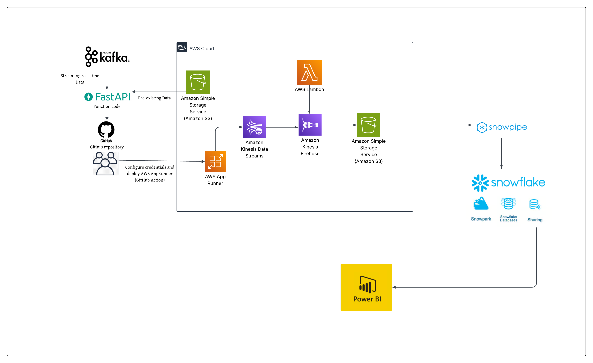

# Build Real Time Data Pipeline using AWS Kinesis and Snowflake

## Project Description
This project focuses on building a real-time data pipeline to analyze global food market data.Leveraging AWS services such as Kinesis, S3, App Runner, and Lambda, along with Snowflake for data storage and processing, the pipeline enables continuous ingestion, transformation, and analysis of live streaming data. Power BI is used to create dynamic dashboards that visualize key trends and patterns, supporting timely and data-driven decision-making. 

## Business Overview 
The management of global food market system involves several stakeholders such as organizations, vendors, regulatory authorities and retailers.Since the food market data can gain significant value over time due to ivolve of operating system & conditions and frequent fluctuations of economic conditions, the information carrried by this type of data is often time-critical allowing only a limited time window to make preventive and predictive actions and effectively implement them. In contrast, reactive data, typically historical and processsed in batch are more suitable for development in buisness intelligence and stratergies. Having a unified platform to analyze real-time data allow stakeholders to manage inquiries and prioritize the decisions that are made using this time-critical information,regardless of the variability and volume of incoming trend. 

## Data 
The global food market data used in this project consisted of data collected from 36 countries across different market for various food items from year 2007 until 2023. The data includes estimated open, close, high and low prices for each food item, as well as inflation rate and trust score (1-10) which refelects the reliability of inflation calculation for each item. After preprocessing and transforming the raw dataset,the segement of [Data for 2007](Data/2007_s3_snowflake_realtime.csv) shows how cleaned dataset looks before analysis.

## Fetching Data using FastAPI
The streaming data market analysis could oriinate from external APIs such as Apache Kafka, server logs or stand- alone applications. For the demonstration in this project, previously streamed data is been stored in a AWS S3 bucket as pre-existing data. The data, whether in real time or pre-existing in the storage bucket is accessed through FastAPI application, which is a modern web framework for building HTTP-based service APIs. The API was deployed using AWS ApppRunner and the S3 bucket was integrated with the FastAPI service to expose the pre-existing data objects as accessible API endpoints.
## Key Objectives 

1. One of the key objectives of the project is to log the row count information, ensuring that it is recorded for later analysis of the data. This will help track changes, monitor trends, and support data-driven decision-making throughout the project. ( only analyze only newly added records ) 


## Project Architecture 

As shown in the reference architecture:
1. Previously streamed data is stored in AWS s3 storage bucket for the use in building the data pipeline and data stored objects are exposed to API endpoint.
2. The FastAPI code created to build the API application is saved in github repository and deployed in AWS AppRunner as a github action.
3. The datafetched through FastAPI is streamed into AWS Kinesis Data Stream.
4. AWS Kinesis  firehose is use to ingest and load the streaming data into the destination which is seperate S3 storage bucket.
5. AWS lambda is use to create an Lambda function to transforms real-time logs into CSV format before delivering the data to final destination, acting as a junction to streamline live data received from the API.
6. Use a snowpipe to automate the data ingestion to snowflake from external sources,s3 storage bucket where transformed data is stored.
7. Snowpark within snowflake is used for pre-processing and transformation of data.
8. The transformed and cleaned data, along with row count information, is logged and saved as separate tables in Snowflake, executed using SnowSQL scripts.
9. PowerBI uilizes the snowflake database connection to retrieve cleaned and prepared data to create visualizations for insightful analysis and informed decision making.

## Overview of each layer 
### Raw Layer 

#### 1. Build and Deploy FastAPI Application via AWS AppRunner 
 **I.** When building the FastAPI application and defining the endpoint to fetch data, the URL path used in this project is for s3 storage bucket with pre-existing data as shown below.
```python
app = FastAPI()

def fetch_data(year: int = None, country: str = None, market: str = None):
 
        # Load CSV content into a pandas DataFrame
        df = pd.read_csv("https://real-time-market-data.s3.us-east-1.amazonaws.com/total_data.csv")
 return {"message": "Welcome! Use /fetch_data endpoint with query parameters."}
```
Completed [application code](app.py) and [requirement files](requirements.txt) can be accessed in the root directory of this repository.

 **II.** When streaming real-time data from external API such as apache kafka, the  URL path can be used for Kafka consumer to get connect with kafka as shown below:
```python
from fastapi import FastAPI
from kafka import KafkaConsumer

app = FastAPI()

@app.get("/kafka-data")
def get_kafka_data():
    consumer = KafkaConsumer(
        'your_topic',
        bootstrap_servers='localhost:9092',  
        auto_offset_reset='latest',
        group_id='my-group'
    )
    for message in consumer:
        return {"data": message.value.decode()}
```
  **III.** The port `8080` and host `'0.0.0.0'` are used allowing server to accept requests from any IP adress.
```python
uvicorn.run(app, host='0.0.0.0', port=8080)
```
**IV.** AWS App Runner which is a fully managed service is used to create and deploy a new service by configuring build settings, specifying the port, linking to a GitHub repository, and defining build and start commands to launch the FastAPI application.

### 2. AWS Kinesis Data Stream 

Amazon Kinesis enables seamless collection, processing, and analysis of real-time streaming data to deliver instant insights and support rapid responses to new information.Unlike traditional methods that require complete data collection before processing, Kinesis allows you to analyze and act on data the moment it arrives.Kinesis Data Stream collects and store data streams for analysis. The data fetched through FastAPI is sent to Kinesis Data Stream by creating a kinesis client using the AWS SDK(boto3).
```python

kinesis_client = boto3.client('kinesis', region_name='us-east-1', aws_access_key_id='',
     aws_secret_access_key='')
```
The [completed code for fetching data from API](Installation_execution_codes/Fetch_data_from_API_vidishai.ipynb) demonstrates how data is retrieved by inivoking API  with configured parameters for the year 2007 and then streamed to the Kinesis Data Stream.

### 3. AWS Kinesis Data Firehose 

Amazon Kinesis Data Firehose is a fully managed service that automatically delivers real-time streaming data to destinations like Amazon S3 and Amazon Redshift. It only requires users to configure the data procedures to send data to firehose and it automatically delivers the data to specified destination.Firehose is focused on data delivery and does not provide long-term data storage; it buffers data for a short period using size-based or time-based thresholds before delivering. Kinesis Data Firehose can transform data before delivering it to the
destination,using AWS Lambda functions, which allows you to modify the data before storing or analyzing it. For this project, the Kinesis Data Firehose was configured with a Kinesis Data Stream as the source and an Amazon S3 bucket as the destination for storing the transformed data.

### 4. AWS lambda integration with Kinesis Data Firehose
AWS Lambda is a serverless compute service that allows to trigger and run code in response to events, without provisioning or managing servers. It automatically scales based on demand and integrates seamlessly with other AWS services and HTTP triggers.In this project, AWS Lambda was integrated with Kinesis Data Firehose, which streamed real-time logs in JSON format.The Lambda function was specifically built to transform these JSON logs into CSV format, enabling compatibility with Snowflake, the downstream data warehouse used for analytics.
The transformation logic is defined within the [Lambda function's handler](Installation_execution_codes/lambda_function.py), which processes incoming records in real time.Once lambda function is integrated with the Kinesis Data Firehose, the Lambda function is triggered automatically whenever new data arrives from the Kinesis Data Stream to Kinesis Data Firehose. It then executes the defined transformation logic to process and format the data before delivery to the destination.

### Transformation Layer 
#### Snowflake 

Snowflake stands out for its robust support of diverse data types, including structured, semi-structured, and unstructured data, making it an ideal platform for advanced use cases like machine learning and artificial intelligence. Functioning as both a data warehouse and a data lake, Snowflake leverages external stages to enable data preprocessing before loading into its core storage layer. This architecture supports both real-time and batch data processing, offering a flexible solution that adapts to evolving business requirements.
Its three-tier architecture distingusishes it by seperating storage, compute, and services.This design enhances scalability, supports high levels of concurrency, and allows multiple users to run queries and analyses simultaneously without performance degradation.

In this project, Snowflake was integrated with an Amazon S3 bucket to serve as the destination for ETL pipeline data streams. The use of Snowpipe automation enabled seamless ingestion of raw data into Snowflake’s staging tables, significantly streamlining the initial data loading and transformation process.Subsequently, Snowpark sessions were utilized to process large datasets efficiently.

**I. Snowpipe** : 

Snowflake Snowpipe is a feature designed for automated data ingestion into Snowflake from external data sources, such as Amazon S3. It operates based on the "continuous ingest" model, where new data arriving in the external stage triggers the automatic loading process into Snowflake tables. This near-real time data ingestion eliminates the need for manual intervention and  ensures that the data in snowflake remains up to date with changes made to the external data stored in the staging area. 

In this project a staging area is created within the selected snowfalke database pointing to the s3 destiniation storage bucket, which stores incoming raw data, followed by creatig two tables within the selected snowflake database and schema of to store the raw data and row count information as shown in the [snowflake script](snowflake_scripts/snowflake-execution_vidisha.sql). Before allowing data ingestion to the snowpipe it is important to aware the snowflake about the file format of the data. Then the snowpipe is created  in snowflake to automate the ingestion of data from the staging area to the snowfalke: 
``` python
CREATE OR REPLACE PIPE my_snowpipe
AUTO_INGEST=True
AS 
COPY INTO RAW_FOOD_DATA
FROM @s3_stage
FILE_FORMAT=(FORMAT_NAME=csv_format);
SHOW pipes;
```
To automate the data loading from s3 destination bucket to snowpipe, an event is created in the s3 bucket and configured event notifications to send messsages SQS que when new objects/data are created in the s3 bucket. The snowpipe ARN is specified in the SQS que, enabling snowpipe to listen for events from the SQS que.

**II. Snowpark session** :

Snowpark is a powerful feature of Snowflake that enables users to write and execute Spark-compatible code directly within the Snowflake platform. By combining Spark's robust processing capabilities with Snowflake's efficient data management and querying, it creates a unified platform to perform data engineering and analytics tasks such as ETL( extract, trasnform, load), data cleaning and advanced analytics without moving the data across various platforms. 

 In this project snowpark session is created in a seperate script to perform data pre-proocessing tasks as shown in the [snowpark script](snowflake_scripts/snowpark_execution_vidisha.py)
 
 1. To enable Snowpark users to communicate efficiently with the Snowflake ecosystem, a connection to the Snowflake environment is established by defining a session object within the main handler function. This function serves as the central point for processing queries and executing various Snowpark operations, ensuring seamless data interaction within Snowflake.
    ```python
    import snowflake.snowpark as snowpark
    def main(session: snowpark.Session): 
    # coding the snowpark operatiions inside the main handler
    ```

2. As one of the key objective of the project is to log the row count information, he `ROW_COUNT` table created in the Snowflake database schema is extracted and transformed into a Spark DataFrame. This is then further converted into a Pandas DataFrame to enable advanced data analysis and visualization.
3. Similarly, the `ROW_FOOD_DATA` created to store the raw data in snowflake is extracted and converted to spark dataframe followed by convertion to a pandas dataframe.
4. To extract only the latest data ingested into Snowpipe, an`if-else loop is implemented on the `ROW_COUNT` table. This ensures that the logic selectively filters and processes the most recent records while disregarding older entries.

| INDEX_NO | NO_OF_ROWS | DATE| NO_OF_ROWS_ADDED | NO_OF_ROWS_TRANSFORMED_TABLE |
|--|--|--|--|--|
| 1 | 20940| 2025-04-28 18:01:06.016003 | 20940| 139848|

5. Pre-processing steps were performed as below:
      1. The columns that contain at least one non-null value are filtered in, while the rest of the columns are dropped.
      2. Only the relevant columns(carries information about key criterias of food items) that are necessary for data analysis are kept, filtering out the rest.
      3. `df.melt()` was implemented to reshape the dataframe, by converting column values to row values, making it easier to analyze.The new variable column is named as `ITEM` and values of the ITEM column as `VALUE`.

         |COUNTRY |MKT_NAME| DATES| ITEM |VALUE|
         |--|--|--|--|--|
         |Afghanistan|Badakhshan|	2007-01-01|O_BREAD|60|
         |Afghanistan|Badakhshan| 2007-01-01 | C_BREAD| 56|

     4. The ITEM column was further split into separate values to extract the name of the item and the category of financial measurement ('Open', 'Close', 'High', 'Low', 'Trust', 'Inflation').
     5. A new column called `TYPE` was inserted to dataframe to store these classifications, followed by renaming the values in the `TYPE` column to reflect their full descriptive format.
        |COUNTRY |MKT_NAME| DATES| ITEM |TYPE|VALUE|
         |--|--|--|--|--|--|
         |Afghanistan|Badakhshan|	2007-01-01|BREAD|OPEN|60|
         |Afghanistan|Badakhshan| 2007-01-01 |BREAD|CLOSE| 56|

      6. df.pivot_table() method was used to unpivot the `TYPE` column in to seperate columns, for easier analysis.
           |COUNTRY |MKT_NAME| DATES| ITEM |OPEN|CLOSE|
         |--|--|--|--|--|--|
         |Afghanistan|Badakhshan|	2007-01-01|BREAD|60|56|
      

         


   
 


